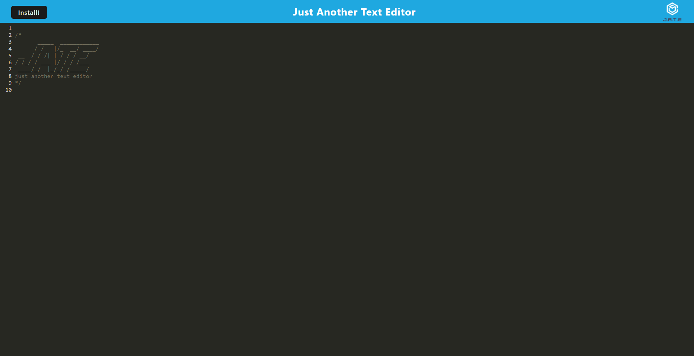

# Text-Editor

  ## Description
  This progressive web application demonstrates how service workers and manifests enable users to download an application and continue using it offline.

  ## Table of Contents
  - [Installation](#installation)
  - [Usage](#usage)
  - [Contributing](#contributing)
  - [Questions](#questions)
  - [Link](#link-to-site)

  ## Installation
  - express
  - webpack
  - style loader
  - css loader
  - babel loader

  ## Usage
  Usage unavailable at this time

  ## Contributing
  Contribution unavailable at this time

  ## Questions
  Please email questions to joseph.s.foster@icloud.com.
  For additional works, please visit [https://github.com/joseph-s-foster]

  ## Link to Site
  https://afternoon-wave-23919-123a5d05765e.herokuapp.com/

  ## Screenshot
  

